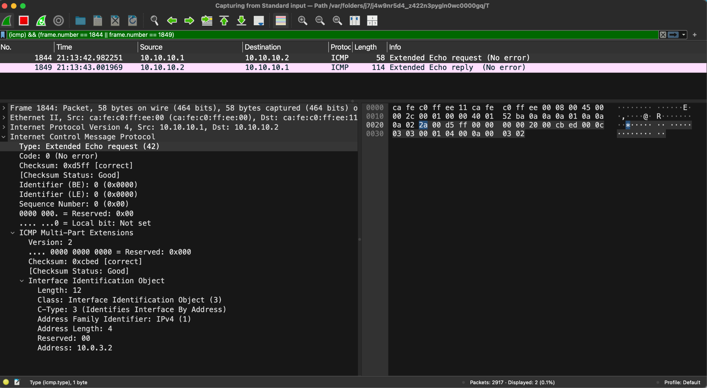
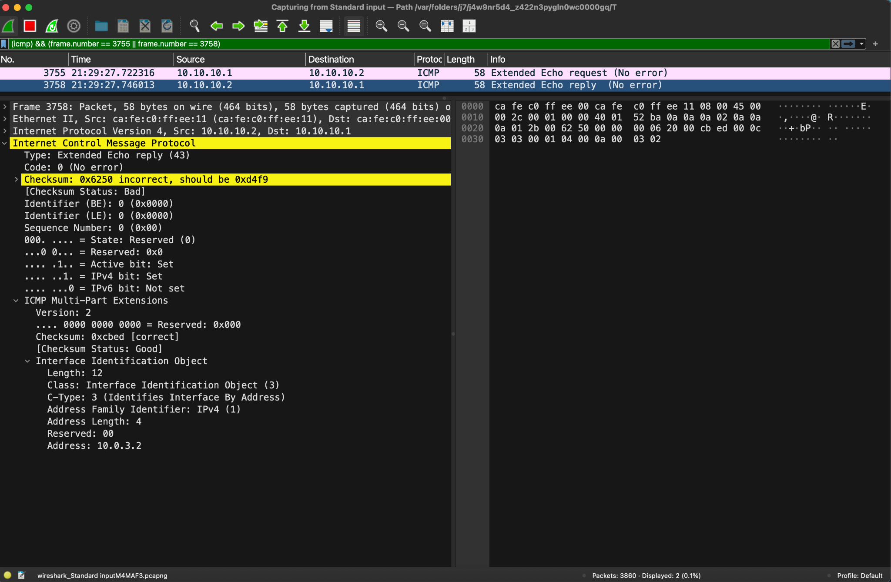

---

# Sender-Receiver CLI Program

This project demonstrates a simple message exchange between a **Receiver (Rx)** and a **Sender (Tx)**.
The receiver must always be started first, and the sender connects to it afterwards.

---

## Overview

This is a PoC to showoff an implementation for the https://datatracker.ietf.org/doc/draft-pignataro-icmp-enviro-info/.
It makes use of Loopback interface, Python (scapy) and the Extended Echo Request/Reply (defined in RFC 8335) to request and carry the information

We have two main components:
* **Receiver (receiver.py)** — waits for incoming data.
  Requires **two arguments**: (0 or 1)

  1. `--probeFlag` → Tells the receiver to include the Interface Identification Object in the response or not
  2. `--greenFlag` → Tells the receiver to include the Environmental Information Object in the response or not

* **Sender (sender.py)** — connects to the receiver and sends data.
  Simply sends an ICMP Extended Echo Request to the receiver.py

Example:
- If probeFlag==1 and greenFlag==1, both the Interface Identification Object and Environmental Information Object are included in the ICMP Extended Echo Reply.
- If probeFlag==1 and greenFlag==0, only the Interface Identification Object is included in the ICMP Extended Echo Reply.

---
## What are we showing off?

* That implementing this is possible.
* With the flags, we can prove that the control to use the extensions defined in this draft, is upto the network administrator, i.e. they can set the flag to 0 to not include the Environmental Information Objects in the Extended Echo Reply.
* The extensions defined in this draft are backwards compatible.
* They are able to inter-op.
* **We are also taking a step ahead and showing off that it is also possible to use Extended Echo Reply for other payloads (Extensions) as well (more about it here [Extending the ICMP Extended Echo Reply to allow carrying only other objects](#extending-the-icmp-extended-echo-reply-to-allow-carrying-only-other-objects))**

---

## Usage

### Start the Receiver

Run the receiver first:

```bash
<sudo> python3 receiver.py --probeFlag=1 --greenFlag=1
```

This starts the program listening on the Linux Loopback interface.

You should see:

```
host$ sudo python3 receiver.py --probeFlag=1 --greenFlag=1
[B] Waiting for ICMP Echo Requests...
```

---

### Start the Sender

Once the receiver is running, open **another terminal** and run:

```bash
<sudo> python3 sender.py
```

This connects to the receiver and sends a ICMP Extended Echo Request:

Sender:
```
host$ sudo ./venv/bin/python3 sender.py 
[A] Sending packet: Ether / IP / ICMP 10.10.10.1 > 10.10.10.2 42 0 / Raw
.
Sent 1 packets.
[A] Waiting for response...
[A] Received packet: Ether / IP / ICMP 10.10.10.2 > 10.10.10.1 43 0 / Raw
[A] Payload: b' \x00\xcb\xed\x00\x0c\x03\x03\x00\x01\x04\x00\n\x00\x03\x02\x00\x0c\t\x01\x00\x00\x00d\x00\x00\x00PKv\xf4f\x00\x00\x00\x00\xdf\xbc\t\x00\x00\x00\x00\x00\x1c\x1d\x1e\x1f !"#$%&\'()*+,-./01234567'
```

Receiver when gets the Extended Echo Request, will formulate an Extended Echo Reply and will attach the Extensions based on the flag values:
```
host$ sudo python3 receiver.py --probeFlag=1 --greenFlag=1
[B] Waiting for ICMP Echo Requests...
[B] Received ICMP: b' \x00\xcb\xed\x00\x0c\x03\x03\x00\x01\x04\x00\n\x00\x03\x02'
.
Sent 1 packets.
[B] Sent ICMP Echo Reply with modified payload
[B] Received ICMP: b' \x00\xcb\xed\x00\x0c\x03\x03\x00\x01\x04\x00\n\x00\x03\x02'
.
Sent 1 packets.
[B] Sent ICMP Echo Reply with modified payload
```

---

## Example of using the scripts:

- Request:
 "Request: via ICMP Extended Echo Request"

- Response: (probeFlag == 1 and greenFlag==1)
 "Response: with ICMP Extended Echo Reply [with Interface Identification and Environmental Information Object]"

- Response: (probeFlag == 1 and greenFlag==0)
 "Response: with ICMP Extended Echo Reply [with only Interface Identification Object]"

- <a name="response_pF0-gF1"></a>Response: (probeFlag == 0 and greenFlag==1)
 "Response: with ICMP Extended Echo Reply [with only Environmental Information Object]"
This is in support for [Extending the ICMP Extended Echo Reply to allow carrying only other objects](#extending-the-icmp-extended-echo-reply-to-allow-carrying-only-other-objects)

---

## Extending the ICMP Extended Echo Reply to allow carrying only other objects:

Presently, ICMP Extended Echo Reply is supposed to carry the Interface Identification Object. Extensions defined in this draft are able to be piggyback on the Extended Echo Reply.

But, what if we just want to use Extended Echo Reply to carry only the Environmental Information Objects or any other future extension objects?
- Hence we took experimental liberty to use the "State" field in the ICMP Extended Echo Reply:

      +-+-+-+-+-+-+-+-+-+-+-+-+-+-+-+-+-+-+-+-+-+-+-+-+-+-+-+-+-+-+-+-+
      |     Type      |     Code      |          Checksum             |
      +-+-+-+-+-+-+-+-+-+-+-+-+-+-+-+-+-+-+-+-+-+-+-+-+-+-+-+-+-+-+-+-+
      |           Identifier          |Sequence Number|State|Res|A|4|6|
      +-+-+-+-+-+-+-+-+-+-+-+-+-+-+-+-+-+-+-+-+-+-+-+-+-+-+-+-+-+-+-+-+
      |   ICMP Extension Structure
      +-+-+-+-+-
      |   [Data...]
- And set it to "7" an unused code.
- With this, we can signal the device to use this code, when the PROBE functionality is turned off, but we need Extended Reply to send other data.
- This has been proved in this test:
      ```bash
      sudo python3 receiver.py --probeFlag=0 --greenFlag=1
      ``` (probeFlag set to 0, but greenFlag set to 1)
- Example for this in action can be found here [response_pF0-gF1](#response_pF0-gF1)
---

## Notes

* The **Receiver must start first**; otherwise, the Sender will fail to connect.
* You can modify flags as necessary.
* We use the lo interface (so we may see DUP responses)

---
